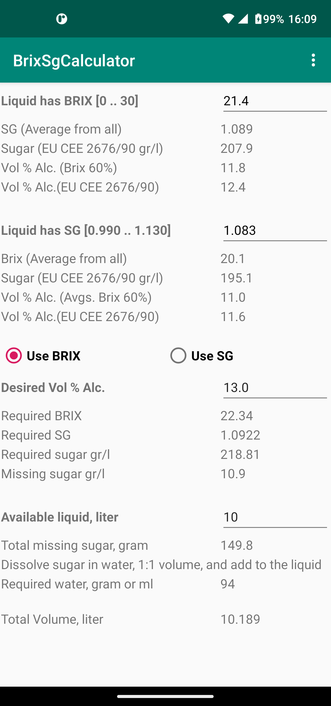
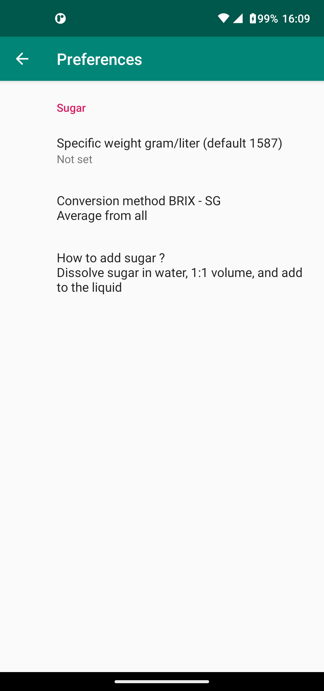
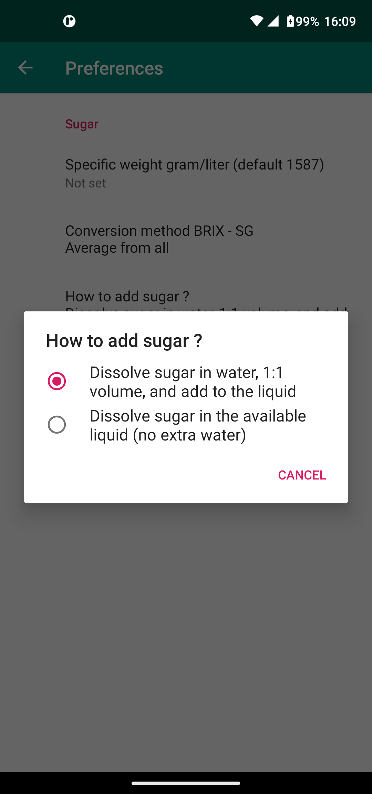
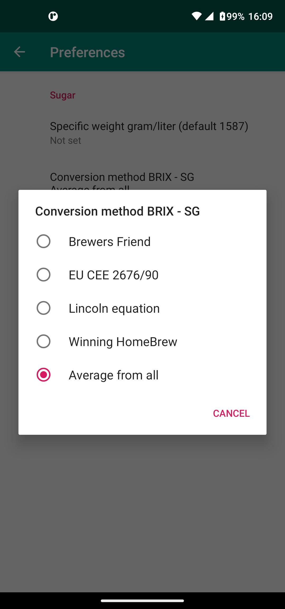

# BrixSgCalculator

My wine brewing attempts had strange results: from just fine to sewage water.
After searching the web I found several methods for converting BRIX to SG or SG to BRIX.
My refractometer had a BRIX and SG scale but converting one to the other did not match.
I needed an ad-free app that did those kinds of calculations and
that calculates the amount of sugar required for brewing wine with a certain percentage of alcohol.

So I came up with this Android app BrixSgCalculator.

Enter the measured BRIX/SG is converted to SG/BRIX, to the amount of sugar in the liquid and to what alcohol percentage this leads.

Enter the desired alcohol Vol % and it calculates the required: BRIX, SG, sugar; and based on the measured BRIX or SG how much sugar is missing.

Enter the available volume liquid, or juice, and it calculates how much sugar is missing in the liquid based on the measured BRIX or SG; and desired alcohol Vol %.

All values are in SI base units (gram, liter,  https://en.wikipedia.org/wiki/SI_base_unit

   

Sources:

 Lincoln equation   https://www.homebrewtalk.com/threads/how-do-you-convert-brix-to-sg.415358/   ajdelange

 Brewers Friend     https://www.brewersfriend.com/brix-converter/

 Winning HomeBrew   https://winning-homebrew.com/specific-gravity-to-brix.html

 EU CEE 2676/90     https://eur-lex.europa.eu/legal-content/en/ALL/?uri=CELEX%3A31990R2676

